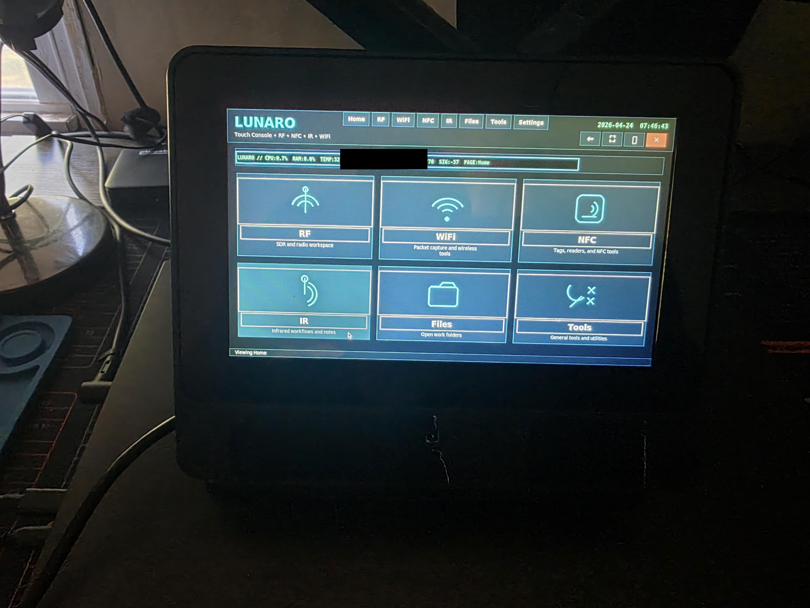
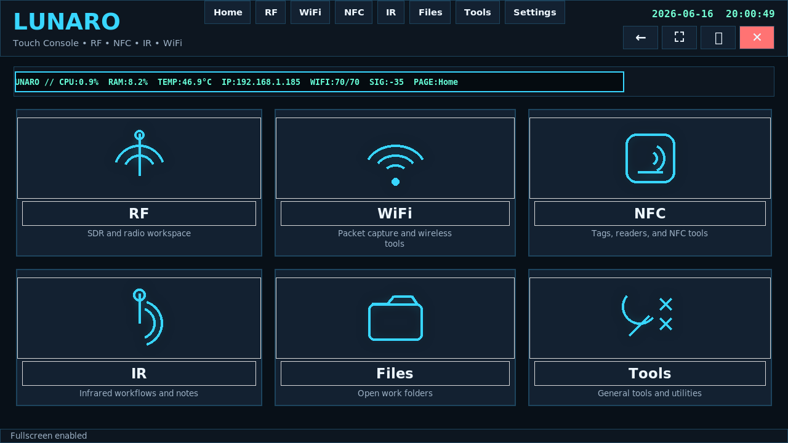

# Lunaro Cyberdeck

## Overview

Lunaro is a Raspberry Pi 5 cyberdeck build with a custom touchscreen launcher, documented hardware integration, and a working Linux desktop environment. The project is organized as an engineering build: hardware assembly, OS setup, troubleshooting, launcher development, and future wireless/RF expansion are tracked separately so completed work is not mixed with planned capability.

The current build centers on:

- Raspberry Pi 5 Model B running Debian GNU/Linux 13 `trixie` on a 1280x720 touchscreen display
- A custom enclosure/stand assembly with rear I/O access and visible internal wiring
- An integrated NFC Module V3 mounted inside the enclosure
- The implemented `Lunaro Touch Launcher` Python/Tkinter interface
- Documented photos and screenshots in `photos/`, `screenshots/`, and `image-inventory.md`

All networking, NFC, wireless, RF, and SDR work is treated as authorized lab work only.

## Current Status

### Completed

- Built the physical Raspberry Pi cyberdeck around a touchscreen display and enclosure.
- Integrated the Raspberry Pi 5 into the enclosure with rear-access USB/Ethernet ports and cable routing.
- Mounted and wired an NFC Module V3 inside the enclosure.
- Brought up the touchscreen as the primary display and validated the launcher running on-device.
- Installed and captured the Linux desktop environment on the Raspberry Pi.
- Installed and ran `fastfetch` to document system details.
- Implemented the `Lunaro Touch Launcher` in Python with a fullscreen touch-oriented UI.
- Added documented photos and screenshots with portfolio-friendly filenames.

### Active Development

- Stabilizing NFC workflows, especially continuous scanning and PN532/NFC reader behavior.
- Refining launcher actions, dependency checks, and workspace organization.
- Expanding documentation for setup steps, hardware wiring, and known troubleshooting notes.
- Validating which external tools are installed on the cyberdeck versus represented as launcher entries.

### Future Expansion

- HackRF and RTL-SDR workflows are future expansion items unless the required SDR hardware and tools are connected and tested.
- Advanced RF capture, demodulation, and signal-analysis workflows are not presented as completed capability.
- Wi-Fi monitoring workflows require compatible hardware, installed tooling, and controlled lab documentation before being treated as complete.
- Additional diagrams and repeatable setup notes should be added as the build is refined.

## Build Evidence

### Hardware Photos

The photo set documents the completed physical build:

- `photos/front-powered-on.jpg` - primary powered-on front view with the Lunaro launcher visible.
- `photos/front-launcher-view.jpg` - straight-on front view of the launcher running on the device.
- `photos/side-angle-powered-on.jpg` - side profile showing the stand angle and desk setup.
- `photos/front-powered-off.jpg` - front enclosure view with the display off.
- `photos/front-enclosure-detail.jpg` - close-up of the lower enclosure and fastener area.
- `photos/rear-ports-view.jpg` - rear/side view showing USB, Ethernet, ventilation, and stand mounting.
- `photos/rear-wiring-view.jpg` - rear wiring and cable-routing view.
- `photos/internal-components.jpg` - open enclosure showing the Raspberry Pi 5, ribbon cable, NFC module, and wiring.
- `photos/nfc-module-closeup.jpg` - close-up of the NFC Module V3 board.
- `photos/launcher-closeup-photo.jpg` - physical close-up of the launcher UI on the touchscreen.

### Screenshots

The screenshot set documents the software environment:

- `screenshots/launcher-main-screen.png` - clean screenshot of the Lunaro launcher home screen.
- `screenshots/desktop-overview.png` - Raspberry Pi desktop environment.
- `screenshots/system-information-fastfetch.png` - terminal output showing Debian GNU/Linux 13 `trixie`, Raspberry Pi 5 Model B Rev 1.1, 1280x720 display, LXDE/Openbox, memory, disk, and network details.

Image names, descriptions, and suggested README usage are tracked in `image-inventory.md`.

## Hardware Integration

The build uses a Raspberry Pi 5 Model B as the core compute platform. The photos document the Pi mounted inside the enclosure, the touchscreen/ribbon connection, rear I/O access, and internal wiring.

Completed hardware work includes:

- Raspberry Pi 5 installed in the enclosure.
- Touchscreen installed and operating as the primary display.
- Rear USB and Ethernet access exposed through the enclosure.
- Stand-mounted form factor assembled and photographed.
- NFC Module V3 mounted inside the enclosure and wired to the Pi.
- Internal cable routing documented with rear and open-enclosure photos.

The build currently documents integration evidence, not a finalized production-grade enclosure. Additional wiring diagrams and assembly notes are still future documentation work.

## Linux Setup and Troubleshooting

The current system screenshot documents a working Raspberry Pi Linux environment:

- OS: Debian GNU/Linux 13 `trixie` `aarch64`
- Host: Raspberry Pi 5 Model B Rev 1.1
- Kernel: Linux `6.12.75+rpt-rpi-2712`
- Desktop: LXDE with Openbox
- Display: DSI 1280x720 at 60 Hz
- Terminal: `lxterminal`
- Local network address shown for `wlan0`

Troubleshooting and setup work already performed includes:

- Booting the Raspberry Pi 5 into a usable desktop environment.
- Bringing up the DSI touchscreen display at 1280x720.
- Using the touchscreen as the launcher target surface.
- Installing `fastfetch` and its dependency flow to document system state.
- Verifying visible network status from the Linux environment.
- Capturing the desktop and system-information screenshots for reproducibility evidence.

Additional step-by-step installation notes should be added as active documentation work rather than treated as complete.

## Lunaro Touch Launcher

`scripts/lunaro_touch_launcher.py` is an implemented Python/Tkinter launcher for the cyberdeck. It is designed for fullscreen touchscreen use and is shown running both in a clean screenshot and on the physical device.

Implemented launcher behavior includes:

- Fullscreen touch-oriented home screen with RF, WiFi, NFC, IR, Files, Tools, and Settings sections.
- Page navigation, back control, fullscreen toggle, exit-to-desktop, launcher exit, and reboot confirmation.
- System status ticker showing CPU, RAM, temperature, IP address, Wi-Fi link quality/signal when available, and current launcher page.
- Clock display in the header.
- Automatic creation of workspace folders under the user's home directory, including `RF`, `NFC`, `IR`, `WiFi`, `Logs`, and RF subfolders.
- File-manager shortcuts for workspace folders when `pcmanfm` is installed.
- Terminal shortcuts when `lxterminal` is installed.
- Optional autostart install/remove support through `--install-autostart` and `--remove-autostart`.

Launcher actions depend on installed system tools. The code checks for missing command dependencies before launching command-based entries.

## NFC Work

The launcher includes implemented NFC helper screens and actions for lab-owned tags:

- Single NFC scan through `nfc-list`.
- UID-only scan output using `nfc-list` filtering.
- Saved-tag tracking in `~/nfc_tags.json`.
- UID logging in `~/Logs/nfc_uids.log`.
- Rename-last-scanned-tag workflow.
- MIFARE Ultralight backup using `nfc-mfultralight`.
- Restore and verify helpers for saved dump files in `~/NFC/dumps`.

Continuous NFC scanning is intentionally marked as temporarily disabled in the launcher while PN532 integration is stabilized. The README does not claim fully completed NFC automation beyond the implemented helper actions.

## Wi-Fi, IR, and General Tools

The launcher includes sections for Wi-Fi, IR, files, and general tools:

- Wi-Fi page entries for Wireshark, an example Nmap version scan, and a Wi-Fi workspace folder.
- IR workspace folder and terminal shortcuts.
- File shortcuts for RF, NFC, IR, WiFi, and Logs.
- Tools page entries for `htop`, terminal access, reboot, and launcher settings.

These are launcher integrations and workspace organization features. Packet capture, monitoring-mode workflows, and IR experiments should be documented separately after hardware and tool testing.

## RF and SDR Boundary

The launcher includes RF workspace organization and helper hooks, but advanced RF/SDR capability remains a future expansion area.

Implemented launcher support includes:

- RF workspace folder creation under `~/RF`.
- Subfolders for `hackrf`, `rtlsdr`, `captures`, `audio`, `notes`, `scripts`, and `presets`.
- `hackrf_info` and `rtl_test` launcher actions for device/tool detection when those tools are installed.
- Script-template generation for HackRF and RTL-SDR capture commands.
- Help text for connecting HackRF/PortaPack and common receive-chain notes.

Not claimed as complete:

- Operational HackRF workflows.
- Operational RTL-SDR capture workflows.
- Advanced RF analysis.
- Demodulation pipelines.
- Any unauthorized wireless or RF activity.

Those items require connected hardware, installed tools, test notes, and legal lab conditions before being documented as completed work.

## Repository Layout

- `README.md` - current project status and engineering summary.
- `image-inventory.md` - original image names, renamed filenames, descriptions, and README-use recommendations.
- `photos/` - documented hardware photos.
- `screenshots/` - launcher, desktop, and system-information screenshots.
- `scripts/lunaro_touch_launcher.py` - implemented Lunaro Touch Launcher source code.
- `notes/project-history.md` - placeholder for future chronological build notes.
- `diagrams/` - placeholder for future wiring/layout diagrams.

## Skills Demonstrated

- Raspberry Pi 5 Linux setup and troubleshooting.
- Touchscreen bring-up and fullscreen UI integration.
- Python/Tkinter application development.
- Hardware integration and internal component documentation.
- NFC module integration planning and helper tooling.
- Workspace automation for cyberdeck lab workflows.
- Clear separation of completed work, active development, and future RF/SDR expansion.
- Ethical lab scoping for networking, wireless, NFC, and RF experimentation.
